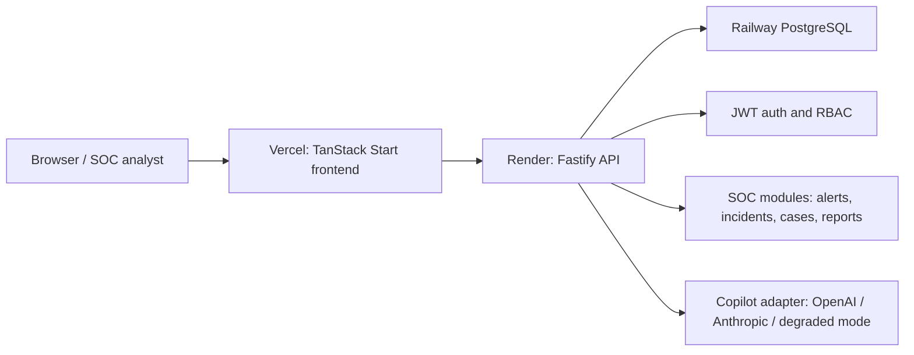

# NEXUS LinkedIn Launch Package

## Professional LinkedIn Post

I’m excited to share NEXUS, an AI-native Security Operations Platform built to bring SOC workflows into one cohesive command center.

NEXUS combines incident response, alert triage, threat intelligence, endpoint visibility, case management, compliance reporting, and Copilot-assisted investigation into a production-ready full-stack application. The goal was to build more than a dashboard: I wanted a realistic security operations workspace with authenticated workflows, multi-tenant data isolation, live PostgreSQL-backed modules, and deployable cloud infrastructure.

Built with React, TanStack Start, Fastify, PostgreSQL, Drizzle, JWT auth, Vercel, Render, and Railway.

Key highlights:

- AI-assisted incident investigation and remediation workflows
- SOC dashboards for alerts, incidents, endpoint posture, and executive risk
- Role-based access control and multi-tenant security boundaries
- Case evidence, report exports, audit logs, and compliance views
- Production deployment pipeline across Vercel, Render, and Railway

This project pushed me through real engineering challenges: production auth, CORS, database migrations, deployment config, security headers, seed data, and end-to-end verification. It has become one of my flagship software engineering projects and a strong foundation for future security automation work.

GitHub: https://github.com/MSC-0013/NEXUS-AI-Native-Security-Operations-Platform
Live demo: <add Vercel URL>

## Project Description

NEXUS is an AI-native security operations platform for SOC teams. It centralizes alert triage, incident response, endpoint risk, threat intelligence, case management, compliance reporting, and AI-assisted investigation in a single workspace.

## Key Features

- JWT authentication and refresh-token sessions
- Role-based access control
- Multi-tenant PostgreSQL schema with row-level security patterns
- Dashboard risk metrics and executive summaries
- Alerts, incidents, timelines, recommendations, and SLA tracking
- Case management with evidence metadata, tasks, watchers, and activity
- Threat intelligence, hunt queries, vulnerabilities, cloud accounts, and network views
- Report listing and CSV export
- Audit logging for mutations
- Copilot workflows with degraded mode when no LLM key is configured
- Production deployment configuration for Vercel, Render, and Railway

## Tech Stack

- Frontend: React 19, TanStack Start, TanStack Router, TanStack Query, Tailwind CSS, Radix UI, Recharts, Framer Motion
- Backend: Fastify 5, Zod, JWT, bcryptjs, Drizzle ORM, postgres.js
- Database: Railway PostgreSQL
- Deployment: Vercel frontend, Render backend, Railway database
- AI: OpenAI/Anthropic adapter support, fallback/degraded mode
- Tooling: TypeScript, Vite, Nitro, Docker, npm workspaces

## System Architecture

## Challenges Solved

- Converted the frontend build to Vercel-compatible TanStack Start + Nitro output.
- Reworked Render infrastructure to use Railway PostgreSQL instead of provisioning Render Postgres.
- Fixed production login by adding persisted bcrypt hashes for demo users.
- Fixed migration issues around indexes and invalid incident status values.
- Hardened CORS for production and preview deployments.
- Verified database-backed APIs against Railway before live platform deployment.

## Performance Highlights

- Production frontend build completed successfully.
- API TypeScript build completed successfully.
- Dashboard, alerts, incidents, events, reports, and evidence metadata calls verified against Railway.
- Indexed database hot paths for events, alerts, incidents, endpoints, network flows, audit logs, and notifications.

## Security Features

- JWT access and refresh tokens
- Refresh-token session persistence
- Account lockout after repeated failed login attempts
- Strong production secret validation
- CORS allowlist with Vercel preview support
- Helmet security middleware on the API
- Vercel security headers
- Row-level security migration coverage
- Audit log plugin for mutation tracking
- SSRF guard for outbound webhook worker logic

## AI and Automation Features

- Copilot workflow support for investigation summaries and response guidance
- LLM provider adapter for OpenAI and Anthropic
- Degraded mode when no API key is configured
- Queue worker code for SLA checks, notifications, webhooks, and retention workflows
- Runbook and automation modules in the product surface

## Development Timeline

- Week 1: Architecture, schema, routes, and UI shell
- Week 2: SOC modules, dashboard, incidents, alerts, and reports
- Week 3: RBAC, RLS, auth hardening, audit, and evidence workflows
- Week 4: Production deployment configuration, migrations, smoke testing, and launch package

## Portfolio Description

NEXUS is a production-oriented cybersecurity SaaS platform that demonstrates full-stack engineering, secure backend architecture, data modeling, deployment automation, and polished frontend product design. It brings together SOC workflows, AI-assisted triage, RBAC, PostgreSQL-backed modules, and cloud deployment across Vercel, Render, and Railway.

## Resume-Ready Summary

Built NEXUS, an AI-native security operations platform using React, TanStack Start, Fastify, PostgreSQL, Drizzle ORM, and TypeScript. Implemented JWT authentication, RBAC, multi-tenant data modeling, SOC dashboards, incident response workflows, case evidence management, report exports, audit logging, and production deployment configuration for Vercel, Render, and Railway.

## SEO-Friendly Hashtags

#SoftwareEngineering #FullStackDevelopment #Cybersecurity #SecurityOperations #SOC #AI #TypeScript #ReactJS #NodeJS #PostgreSQL #Fastify #Vercel #Render #Railway #CloudDeployment #WebDevelopment #PortfolioProject #OpenSource

## Social Captions

- Short: Launched NEXUS, an AI-native Security Operations Platform built with React, Fastify, PostgreSQL, and cloud deployment across Vercel, Render, and Railway.
- Technical: NEXUS brings together SOC dashboards, incident response, RBAC, PostgreSQL migrations, report exports, audit logging, and AI-assisted investigation in a deployable full-stack platform.
- Portfolio: My flagship full-stack project: a production-oriented cybersecurity platform with polished UX, secure backend architecture, and real deployment infrastructure.

## Screenshots To Capture

- Login page with NEXUS branding
- Main dashboard with risk metrics and trend charts
- Alerts list with severity/status filters
- Incident detail view with timeline and linked evidence
- Cases workspace with evidence/tasks/activity
- Copilot investigation workflow
- Reports page and CSV download
- Platform health/status page
- Deployment dashboards for Vercel, Render, and Railway

## Suggested GIFs / Screen Recordings

- Login to dashboard transition
- Alert triage to incident detail
- Creating and deleting case evidence metadata
- Report CSV download
- Copilot prompt to investigation summary
- Dashboard navigation across SOC modules
- Production deploy flow: GitHub push to Vercel/Render build logs

## Banner and Thumbnail Ideas

- Banner: dark SOC command-center dashboard with title "NEXUS: AI-Native Security Operations"
- Thumbnail: dashboard risk score, incident timeline, and alert queue arranged as a product collage
- Carousel cover: "I built a production-ready AI Security Operations Platform"

## Carousel Structure

1. Cover: NEXUS, AI-Native Security Operations Platform
2. Problem: SOC teams need unified triage, investigation, and reporting
3. Login/Auth: JWT sessions, RBAC, production-safe seeded accounts
4. Dashboard: live risk metrics, threats, endpoint health, cloud risk
5. Alerts/Incidents: triage, SLA tracking, timelines, recommendations
6. Cases/Evidence: long-running investigations, evidence metadata, tasks
7. AI Copilot: investigation support and remediation guidance
8. Reports/Compliance: exports, governance, audit visibility
9. Architecture: Vercel frontend, Render API, Railway PostgreSQL
10. Deployment: migrations, env vars, builds, smoke tests
11. Lessons: production auth, CORS, migrations, platform constraints
12. CTA: GitHub repo and live demo
